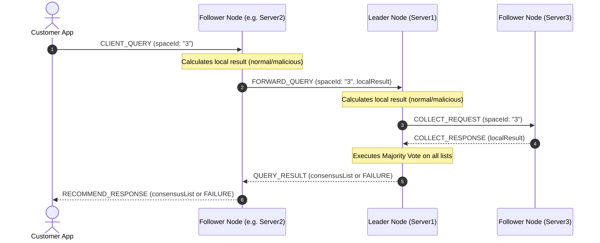

# Consensus Protocol Design Document

## 1. Overview
The **Parking Recommender System** is built as a fault-tolerant, high-availability cluster consisting of three independent nodes:
- `Recommender1` (Leader / Coordinator): Port `8091`
- `Recommender2` (Follower): Port `8092`
- `Recommender3` (Follower): Port `8093`

To protect against database discrepancies, single-node failure, and malicious/compromised nodes, the system implements a socket-based **Consensus Protocol** with majority voting.

---

## 2. Protocol Messaging Sequence

The workflow for recommendation requests and cluster coordination is structured as follows:



### Protocol Message Details (JSON Schema)

1. **`CLIENT_QUERY`** (Client to Cluster Node)
   - Initiated by the Customer GUI or CLI to request a recommendation.
   - Example:
     ```json
     {
       "type": "CLIENT_QUERY",
       "spaceId": "3",
       "correlationId": "f47ac10b-58cc-4372-a567-0e02b2c3d479"
     }
     ```

2. **`FORWARD_QUERY`** (Follower to Leader)
   - Sent by a follower to forward the client's request along with the follower's own pre-calculated result.
   - Example:
     ```json
     {
       "type": "FORWARD_QUERY",
       "spaceId": "3",
       "localResult": "3;0",
       "nodeId": "recommender2",
       "correlationId": "f47ac10b-58cc-4372-a567-0e02b2c3d479"
     }
     ```

3. **`COLLECT_REQUEST`** (Leader to Follower)
   - Sent by the leader to collect local recommendations from other followers.
   - Example:
     ```json
     {
       "type": "COLLECT_REQUEST",
       "spaceId": "3"
     }
     ```

4. **`COLLECT_RESPONSE`** (Follower to Leader)
   - Sent by a follower in response to a `COLLECT_REQUEST`.
   - Example:
     ```json
     {
       "type": "COLLECT_RESPONSE",
       "nodeId": "recommender3",
       "localResult": "3;0"
     }
     ```

5. **`QUERY_RESULT` / `RECOMMEND_RESPONSE`** (Leader to Client/Follower)
   - The final response containing the consensus calculation result or error details.
   - Example (Success):
     ```json
     {
       "status": "SUCCESS",
       "result": "3;0"
     }
     ```
   - Example (Failure):
     ```json
     {
       "status": "FAILURE",
       "reason": "No majority consensus reached in cluster."
     }
     ```

---

## 3. Consensus & Majority Voting Algorithm

For a recommendation list to be accepted by the cluster, it must achieve a **majority vote**. 
A majority is defined mathematically as:
$$\text{Threshold} = \lfloor \frac{N}{2} \rfloor + 1$$

For $N=3$ cluster nodes, the consensus threshold is **2 nodes**.

### Deterministic Result Serialization
To ensure that list results can be compared as simple strings, each node sorts its recommendation results by space ID numerically before serializing them into a comma-separated format.
For example, if a node recommends spaces `4` (with `2` citations) and `3` (with `1` citation), the serialized list is sorted and formatted deterministically as:
`3;1, 4;2`

### Fault Tolerance & Resiliency
1. **Offline Resiliency**: If one follower node is offline or fails to respond within the `TIMEOUT_MS` window, the leader can still proceed. Since it has its own vote and the querying node's vote (totaling 2 votes), it can successfully reach a majority of 2 and return a valid result.
2. **Malicious Protection**: If one node is compromised and running in **Malicious mode** (injecting falsified recommendations, e.g. `999;999`), its vote will not match the valid votes computed by the other two normal nodes. The leader's majority voter will discard the outlier vote and successfully return the valid consensus recommendation list.
3. **No Consensus Safety**: If more than one node is compromised or offline, or if the cluster is partitioned such that no 2 nodes compute the same result, the leader safety aborts and returns a `FAILURE` status, ensuring incorrect information is never returned to the customer.
