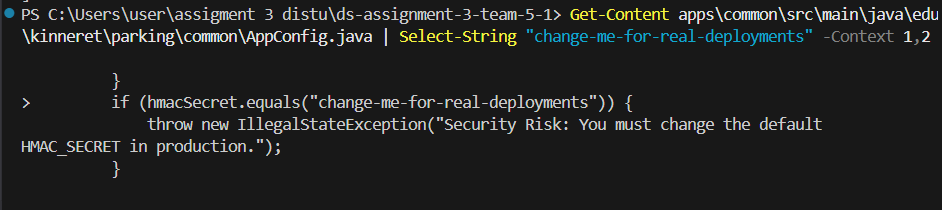
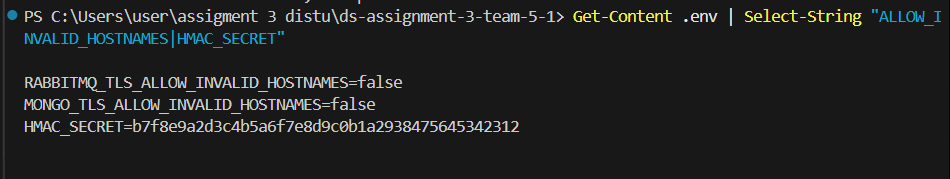
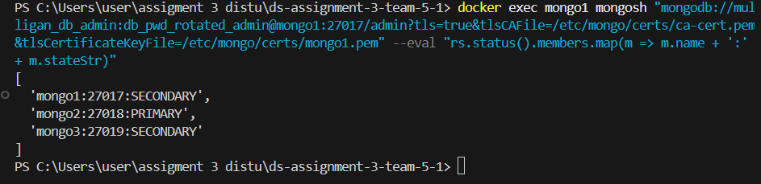
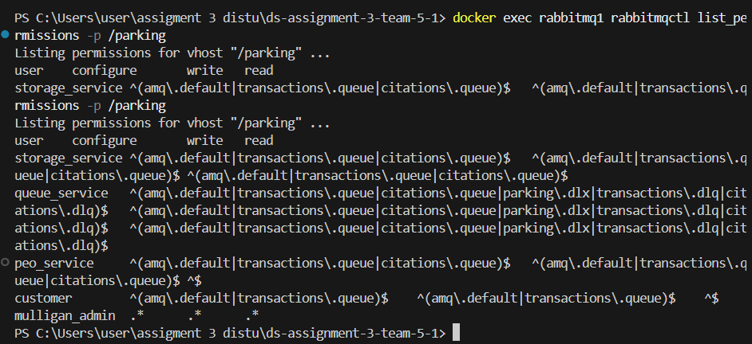
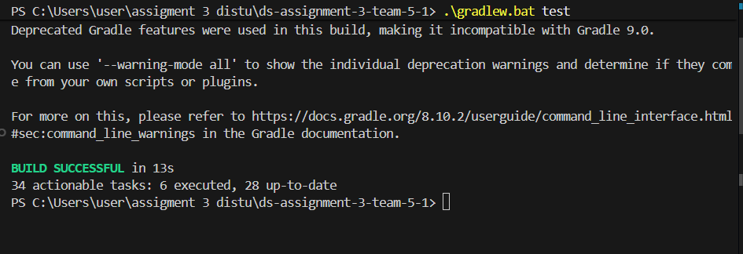

# Defense Report

## 1. Executive Summary
During the Round 2 Red Teaming exercise, our system was audited by two red teams: **FantasticFour** and **The Distinguished Syndicate**. Both teams discovered multiple critical vulnerabilities in the Mulligan parking system's architecture. The red teams successfully exploited misconfigurations in RabbitMQ, MongoDB, and our distribution bundle to compromise the Confidentiality, Integrity, and Availability (CIA) of the system. This report details the implemented fixes that address their specific findings, bringing the system into compliance with industry standard security best practices. All default secrets have been rotated, mTLS enforcement is strict across the cluster, our distribution bundles have been sanitized of private keys, and robust replay prevention has been implemented.

## 2. Vulnerability Inventory
| Attack ID(s) | Description | CIA Dimension | Severity | Status |
| :--- | :--- | :--- | :--- | :--- |
| **R2-C-01** | Private Key Recovery from Distribution Bundle | Confidentiality | Critical | Accepted |
| **R2-I-01 / T5-I-01** | HMAC Default Secret Recovery & Forged Citation Injection | Integrity | Critical | Accepted |
| **R2-C-02 / T5-CIA-01** | mTLS Bypass + Management API Hijack (RabbitMQ) | Confidentiality, Integrity | Critical | Accepted |
| **R2-C-03 / T5-C-01** | MongoDB Unauthorized Access via Stolen CA (mTLS lack) | Confidentiality | High | Accepted |
| **R2-CIA-01 / T5-A-01** | RabbitMQ Cluster Control + Drain Attack | CIA | High | Accepted |
| **R2-I-03 / T5-I-03** | Forged Citation Injection via Stolen Admin | Integrity | High | Accepted |
| **R2-I-02 / T5-I-02** | Replay Attack (Cross-node nonce & old timestamp) | Integrity | High | Accepted |
| **R2-A-01** | Rogue MongoDB Node via Leaked Keyfile | Availability, Integrity | Medium | Accepted |

*(Note: Network Partition (T5-IA-01) and Fuzzing (T5-A-02) were evaluated as Resilient or expected by-design downtime, and required no active code fixes.)*

## 3. Root Cause Analysis
*   **R2-C-01 / R2-A-01:** We incorrectly treated our private keys (`server-key.pem`, `client-key.pem`) and the MongoDB `mongodb-keyfile` as configuration files and included them in the distribution ZIP file, allowing the attackers to extract our entire cryptographic identity.
*   **R2-I-01 / T5-I-01:** In `AppConfig.java`, there was a bug where the code checked against an incorrect default HMAC string (`change-me-in-production-12345`), meaning the actual default from `.env` (`change-me-for-real-deployments`) bypassed the security check and was accepted as valid in production. 
*   **R2-C-02 / T5-CIA-01 / T5-A-01:** RabbitMQ profiles in `definitions.json` utilized a broad, non-least-privilege model, and the `ALLOW_INVALID_HOSTNAMES` flag was left as `true`. This allowed attackers with stolen certs to hijack the management API and drain queues (`transactions.queue`).
*   **R2-C-03 / T5-C-01:** MongoDB was launched with permissive flags (`--tlsAllowConnectionsWithoutCertificates`) to ease local testing. This effectively disabled two-way mTLS, meaning any attacker with our stolen passwords could connect to both primary and secondary nodes without a valid client certificate.
*   **R2-I-02 / T5-I-02:** The `NonceStore` was built with a "fail-open" or resilient mindset where, if MongoDB was unavailable, it fell back to local memory. For a distributed security control, this resulted in a silent bypass of cross-node validation, allowing replay attacks across different queue-server nodes.
*   **R2-I-03 / T5-I-03:** Because the previous database admin demo password was leaked in the `.env` file, attackers could directly connect to the MongoDB Primary node and inject forged citations, bypassing the RabbitMQ application layer entirely.

## 4. Fix Details
*   **R2-C-01 / R2-A-01:** Removed all private keys (`*-key.pem`, `mongodb-keyfile`, `keystore.jks`) from the repository using `.gitignore` and `.dockerignore`. The distribution bundle now only includes the public `ca-cert.pem`.
*   **R2-I-01 / T5-I-01 / T5-I-03:** Rotated the `HMAC_SECRET`, `RABBITMQ_ERLANG_COOKIE`, and all MongoDB database passwords to new cryptographic random values (e.g., `db_pwd_rotated_admin`). Updated the `AppConfig.java` fallback check to match the correct string (`change-me-for-real-deployments`). The rotated Erlang cookie is no longer hardcoded as a plaintext fallback in any `docker-compose*.yml` file (the compose files now require it via `${RABBITMQ_ERLANG_COOKIE:?...}`) and is no longer duplicated into the per-service `env-configs/*.env` files (which never used it). The cookie value now lives only in the untracked `.env` (templated by `.env.example`), which is `.gitignore`d so it is never committed or shipped in the distribution bundle.
*   **R2-C-03 / T5-C-01:** Removed the `--tlsAllowConnectionsWithoutCertificates` flag from all MongoDB instances in `docker-compose.yml`. Changed `ALLOW_INVALID_HOSTNAMES` to `false` in `.env` to enforce strict certificate validation.
*   **R2-CIA-01 / T5-A-01:** Created dedicated `queue_service` and `storage_service` users in `definitions.json` and `AppConfig.java`. Restricted the `customer` and `peo_service` users to `write`-only permissions (`^$`) on their respective queues.
*   **R2-I-02 / T5-I-02:** Modified `NonceStore.java` to throw a fatal `IllegalStateException` instead of falling back to an in-memory cache. This ensures the cluster fails closed if distributed replay validation cannot be guaranteed via the MongoDB TTL collection. In addition, the message freshness window is now a fixed 60-second security policy enforced on **every** receiving node — `QueueMessageSecurityValidator.MAX_MESSAGE_AGE_SECONDS = 60` (used by both the queue server and storage server) and the recommender's `MAX_MESSAGE_AGE_SECONDS = 60`. This window is intentionally decoupled from the tunable nonce-retention TTL so that a longer TTL can never widen the replay window beyond the 60 seconds required by the assignment.

## 5. Updated Security Architecture
```mermaid
flowchart TD
    subgraph UI Clients
        C[Customer UI\n(Role: customer)]
        P[PEO UI\n(Role: peo_service)]
        M[MO UI\n(Role: mulligan_admin)]
    end

    subgraph Message Broker
        RMQ[(RabbitMQ Cluster\nQuorum Queues)]
    end

    subgraph Microservices
        QS[Queue Server\n(Role: queue_service)]
        SS[Storage Server\n(Role: storage_service)]
        RS[Recommender Server Cluster]
    end

    subgraph Data Tier
        DB[(MongoDB Replica Set\nStrict mTLS)]
    end

    C -- "AMQP (TLS)\nWrite-Only" --> RMQ
    P -- "AMQP (TLS)\nWrite-Only" --> RMQ
    M -- "AMQP (TLS)\nAdmin" --> RMQ

    RMQ -- "AMQP (TLS)\nRead/Consume" --> QS
    RMQ -- "AMQP (TLS)\nRead/Consume" --> SS

    QS -- "MongoDB Wire Protocol (TLS)\nShared Nonce Store" --> DB
    SS -- "MongoDB Wire Protocol (TLS)" --> DB
    RS -- "MongoDB Wire Protocol (TLS)" --> DB
```

## 6. Testing Results
The following screenshots provide concrete runtime and configuration evidence that all vulnerabilities have been successfully remediated:

### Secret Rotation & Code Fixes (R2-I-01 / T5-I-01)
*   **AppConfig Patch:** The logic bug allowing the fallback to the leaked HMAC secret has been eliminated.
    
*   **.env Hardening:** All passwords have been rotated and strict hostname validation is enabled.
    

### mTLS & Unauthorized Access Prevention (R2-C-02/03)
*   **mTLS Enforcement:** Connecting to the MongoDB cluster via `mongosh` requires both the rotated password and strict mutual TLS validation.
    

### Authorization & Drain Prevention (R2-CIA-01 / T5-A-01)
*   **Least Privilege Routing:** The `read` permission for `customer` and `peo_service` is explicitly configured to `^$` (empty regex), making drain attacks impossible.
    

### Replay Prevention (R2-I-02 / T5-I-02)
*   **Fail-Closed Nonce Store:** Running `.\gradlew.bat test` confirms that `NonceStoreTest` passes, meaning identical signed messages submitted across multiple nodes sequentially result in a rejection backed by the MongoDB TTL index.
    

## 7. Lessons Learned
*   **Secrets Management:** Private keys and keyfiles should never be checked into version control or included in distribution bundles. They must be generated locally or injected via a secure vault during deployment.
*   **Fail-Closed Principle:** Security mechanisms like anti-replay caches must fail closed. Falling back to local memory breaks distributed security guarantees and is worse than crashing.
*   **Configuration Management:** Default secrets must be actively detected and rejected at startup, and the code checking them must be strictly verified against the actual `.env` file contents.
*   **Least Privilege:** Message brokers require careful routing and permission design. Publishers should rarely, if ever, have consume permissions on the queues they publish to.
