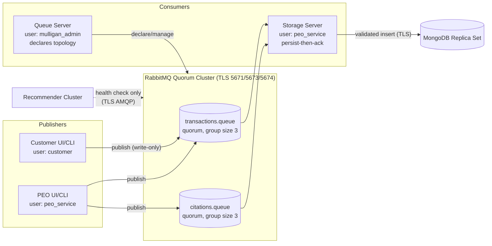

# Queue Server Design Document - Mulligan Parking System

## Team Members
| Name | Student ID | Task Performed | Hours Worked |
| :--- | :--- | :--- | :--- |
| **Walaa Mruwat** | 325224194 | Task 1: User Interfaces | 20 Hours |
| **Hanan Taha** | 212277438 | Task 2: Queue Server | 20 Hours |
| **Aseel Shaheen** | 214228009 | Task 4: Documentation | 20 Hours |
| **Hala Assadi** | 324830967 | Task 3: Database and Storage | 20 Hours |
| **Taqwa Mrowat** | 212804017 | Task 5: Security Hardening | 20 Hours |

## 1. Messaging Topology

- RabbitMQ version: `3.13-management`
- Node layout: `rabbitmq1`, `rabbitmq2`, `rabbitmq3`
- Host TLS ports: `5671`, `5673`, `5674`
- Host HTTPS management ports: `15671`, `15673`, `15674`
- Application vhost: `/parking`

### Topology Diagram



The repository now includes a reproducible setup script:

```powershell
.\scripts\setup-rabbitmq-cluster.ps1
```

This script joins `rabbitmq2` and `rabbitmq3` to `rabbitmq1` after `docker compose up -d`.

## 2. Required Queues

The system uses two required queues:

- `transactions.queue`
- `citations.queue`

Both are declared as:

- durable
- non-exclusive
- non-auto-delete
- quorum queues
- `x-quorum-initial-group-size=3`

Queue definitions exist in:

- `docker/rabbitmq/definitions.json`
- `apps/queue-server/.../RabbitMqTopologyInitializer.java`

## 3. RabbitMQ Security Model

Least-privilege accounts:

- `customer`: publish to `transactions.queue`
- `peo_service`: read/write `transactions.queue` and `citations.queue`
- `mulligan_admin`: topology and administrative operations

Transport hardening:

- external plaintext AMQP is not exposed
- TLS AMQP listeners are used for host access
- HTTPS management listeners are enabled
- peer verification is required
- client applications reject `guest` credentials

## 4. Client Failover and Recovery

The shared `RabbitMqConnectionManager` reads `RABBITMQ_NODES` as a comma-separated node list and tries nodes in round-robin failover order.

Current runtime behavior:

- fresh connection attempts fail over across `5671`, `5673`, and `5674`
- automatic RabbitMQ connection recovery is enabled
- topology recovery is enabled
- the long-running storage-server consumers use RabbitMQ automatic recovery

## 5. Queue Server Flow

`QueueServerApplication` performs these steps:

1. load runtime configuration
2. verify at least one RabbitMQ node is reachable
3. declare the required quorum queues
4. exit successfully after topology initialization; storage-server owns both consumers

`StorageServerApplication`:

- validates each `MessageEnvelope`
- performs business payload validation
- inserts accepted messages into MongoDB and only then acknowledges them
- rejects invalid messages without requeue

## 6. Smoke Test

`QueuePublisherSmokeTest` publishes one signed message to each required queue using the configured node list. The smoke test defaults to the `peo_service` account so it can publish to both queues without using admin credentials.

## 7. Message Security Controls (Blue-Team Hardening)

Every message accepted from a queue is validated by `QueueMessageSecurityValidator` on **every** consuming node (queue server and storage server), not only on a single primary:

1. **HMAC-SHA256 authentication** — each `MessageEnvelope` is signed over its canonical content with the shared `HMAC_SECRET`; verification uses a constant-time comparison (`SecureMessageSigner`).
2. **Replay protection** — the `nonce` is recorded in a cluster-wide MongoDB TTL collection (`NonceStore`). The store fails **closed**: if the distributed nonce collection is unreachable it raises a fatal error rather than silently falling back to per-node memory, so a nonce replayed against any node is rejected.
3. **Timestamp freshness** — messages older than `QueueMessageSecurityValidator.MAX_MESSAGE_AGE_SECONDS = 60` seconds (or more than 60 seconds in the future) are rejected. This 60-second window is a fixed security policy and is intentionally decoupled from the configurable nonce-retention TTL.
4. **Business payload validation** — `ValidationUtils` enforces type, range, length, and character-set checks on every payload field; rejections return a generic reason to the client while full detail is written only to the persistent security log.

## 8. Recommender Use of RabbitMQ

The recommender cluster does not publish parking transactions; it reads parking/citation data from MongoDB to compute recommendations. On startup each recommender node performs a TLS AMQP **health check** against the broker node list (`RabbitMqConnectionManager.checkHealth()`) to confirm broker reachability and TLS/mTLS configuration, and logs the result. This keeps the broker as the single observability point for cluster health without granting the recommender publish or consume rights on the application queues.

## 9. Verification Commands

```powershell
docker exec rabbitmq1 rabbitmqctl cluster_status
docker exec rabbitmq1 rabbitmqctl list_queues name type durable arguments leader members
docker exec rabbitmq1 rabbitmqctl list_users
docker exec rabbitmq1 rabbitmqctl list_permissions -p /parking
.\gradlew.bat :queue-server:runQueueServer
.\gradlew.bat :queue-server:runQueueSmokeTest
```
