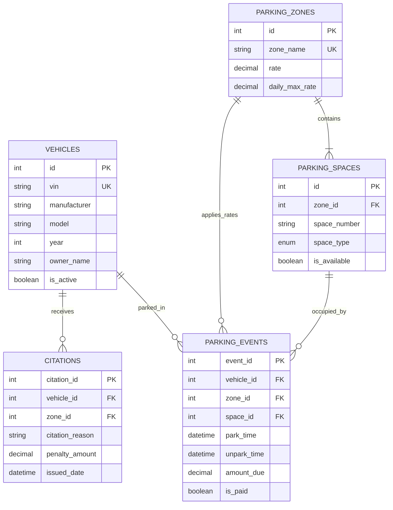

# LEGACY / ARCHIVED DOCUMENT

This file belongs to an older pre-hardening delivery package. It is not the current Stage 2 database design. Use the repository-root `DatabaseDesign.md` for the current MongoDB replica-set design.

# Database Design - Mulligan Parking System

## Overview
The Mulligan system uses a relational database schema (MySQL 8.0) to model the lifecycle of parking events, citations, and system entities (Vehicles, Zones, Spaces). The design prioritizes data integrity through foreign key constraints and optimizes retrieval using strategic indexing.

## Entity Relationship Diagram (ERD)


## Indexing Strategy
To ensure the system remains responsive under load (Red-Team scenario), the following indexes are implemented:
- **`idx_vin`**: Accelerates vehicle lookup by VIN during Start/Stop events.
- **`idx_is_available`**: (Composite with `zone_id`) Fast retrieval of available spaces for a specific zone.
- **`idx_is_paid`**: Optimization for Management Office (MO) financial reports.
- **`idx_park_time`**: Supports chronological report generation.

## Key Queries
1. **Occupancy Check (SUC-1)**:
   ```sql
   SELECT is_available FROM parking_spaces WHERE id = ?;
   ```
2. **Fee Calculation (SUC-2)**:
   ```sql
   -- Duration (hours) * Zone Rate
   SELECT pz.rate FROM parking_zones pz 
   JOIN parking_events pe ON pe.zone_id = pz.id 
   WHERE pe.event_id = ?;
   ```

## Initialization & Sample Data
The database is initialized using `schema.sql` and `sample_data.sql` located in `config/database/`. It includes:
- **10 Vehicles** with unique VINs.
- **15 Parking Zones** with varied hourly rates ($0.80 to $88.28).
- **100 Parking Spaces** distributed across zones.
