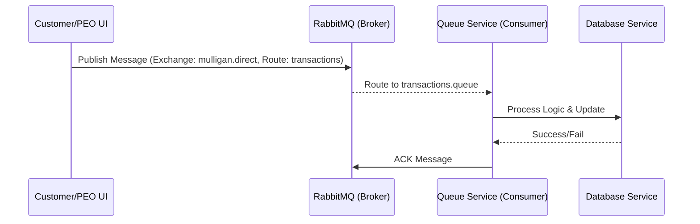

# LEGACY / ARCHIVED DOCUMENT

This file belongs to an older pre-hardening delivery package. It is not the current Stage 2 queue design. Use the repository-root `QueueServerDesign.md` for current RabbitMQ TLS and quorum queue details.

# Queue Server Design - Mulligan Parking System

## Overview
The Mulligan system utilizes RabbitMQ as a high-performance message broker to facilitate asynchronous communication between the User Interfaces (UI) and the backend services. This ensures that UI responsiveness is not impacted by database latencies or external service delays.

## Architecture & Message Routing
The system implements a **Direct Exchange** pattern to precisely route messages to the correct processing logic.



## Broker Configuration
- **Host**: `mulligan-rabbitmq` (internal Docker network)
- **Port**: 5672 (AMQP)
- **Exchange**: `mulligan.direct` (Type: `direct`)
- **Durability**: Exchanges and queues are durable to survive broker restarts.

## Queues
1. **`transactions.queue`**:
    - **Routing Key**: `transactions`
    - **Purpose**: Handles start/stop parking events.
    - **Schema**:
      ```json
      {
        "vin": "VIN-123",
        "spaceNumber": "A1",
        "timestamp": "2026-04-04T12:00:00"
      }
      ```
2. **`citations.queue`**:
    - **Routing Key**: `citations`
    - **Purpose**: Handles new citations issued by PEOs.
    - **Schema**:
      ```json
      {
        "vin": "VIN-123",
        "reason": "Overstayed",
        "enforcerId": 12,
        "penaltyAmount": 50.00
      }
      ```

## Reliability Features
- **Message Durability**: Messages are marked as persistent.
- **Manual Acknowledgements**: Consumers only acknowledge messages after successful database updates (SUC compliance).
- **Dead Letter Exchange (DLX)**: Failed messages are routed to `mulligan.dlx` for later audit/reprocessing.
